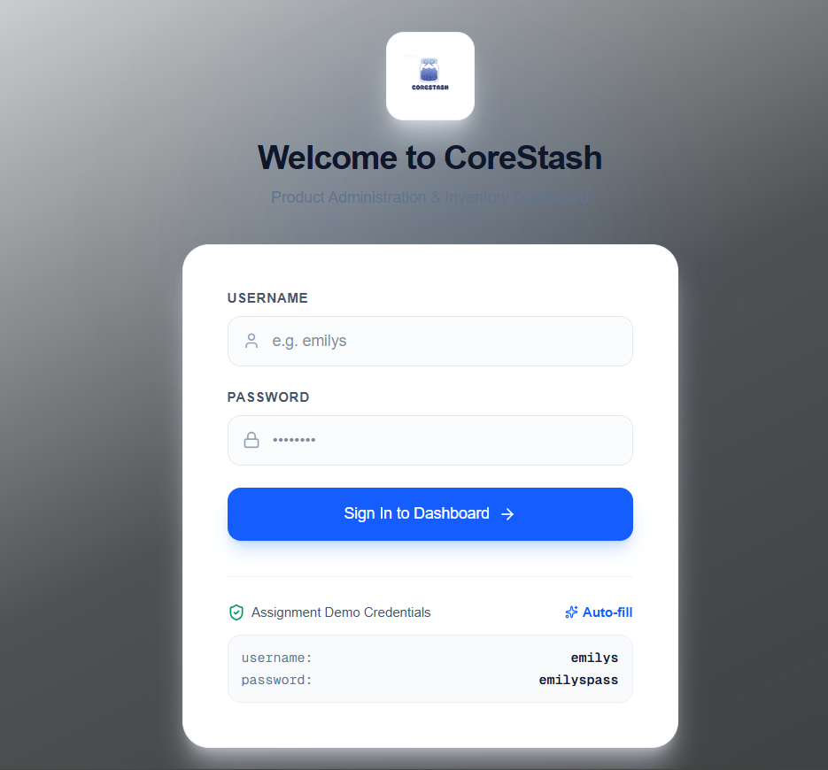
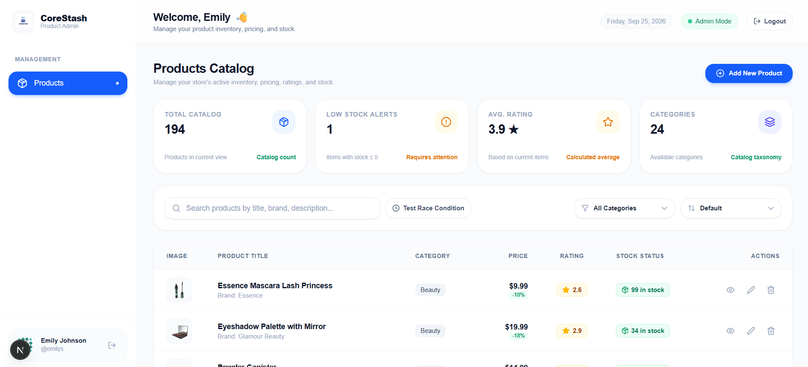
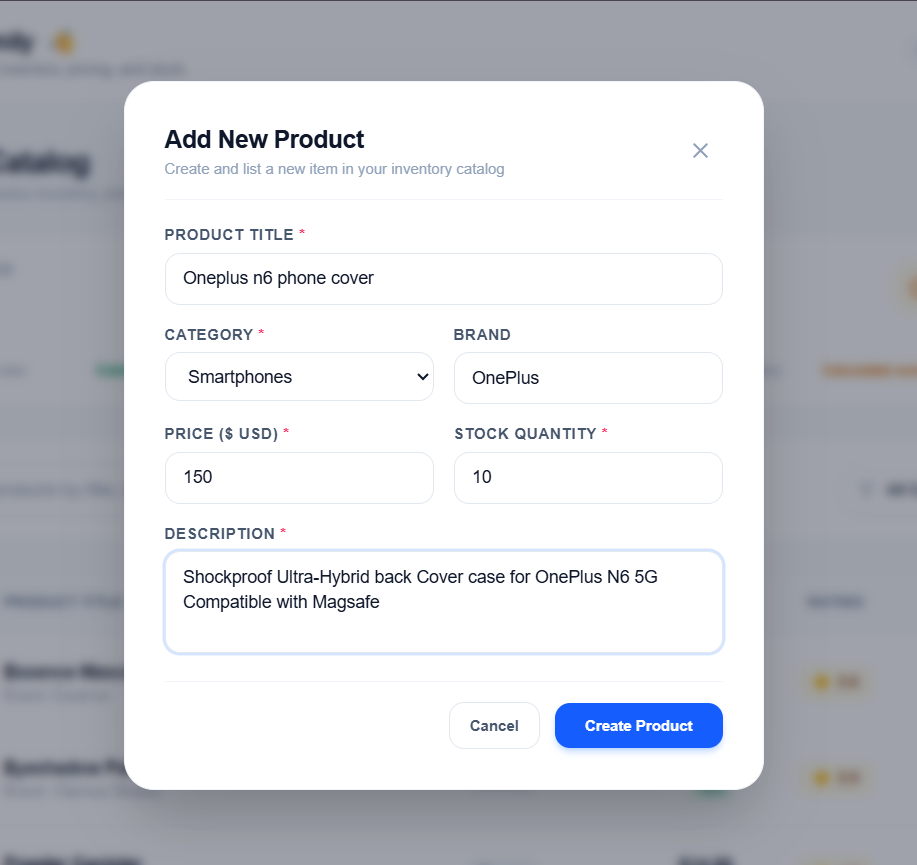
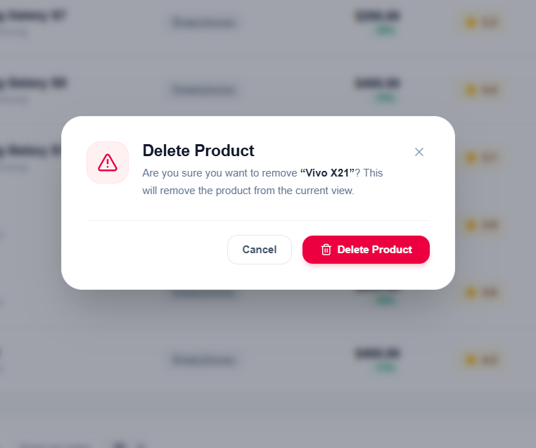

# CoreStash — Product Admin Dashboard

A responsive **Product Administration Dashboard** built for the Nexgensis Technologies frontend assignment using **Next.js, React, Tailwind CSS, Axios, and DummyJSON**.

The application provides authenticated product management with pagination, debounced search, category filtering, sorting, product details, CRUD-style UI interactions, responsive layouts, URL-synchronized state, and loading/error/empty states.

---

## 🚀 Live Demo & Repository

| Resource              | Link                                         |
| --------------------- | -------------------------------------------- |
| **Live Demo**         | product-admin-dashboard-pi-olive.vercel.app        |
| **GitHub Repository** | https://github.com/Saniya2229/Product-admin-dashboard |

---

## 📌 Project Requirements

This project was developed for the **Frontend : Product Admin Dashboard**.

The project requires:

- Next.js + React + Tailwind CSS + Axios
- DummyJSON API
- Login and protected product pages
- Product listing with responsive desktop/mobile layouts
- Custom pagination
- Debounced product search
- Category filtering and sorting
- Product details
- Add, edit and delete interactions
- Loading, empty and error states
- Shared Axios configuration
- URL-based page/search/filter/sort state
- Race-condition handling for fast search
- Protection against repeated Login/Save requests
- No React Query, SWR, or ready-made table/pagination libraries

---

## ✨ Completed Features

### 🔐 Authentication & Protected Routes

- [x] Login using DummyJSON `POST /auth/login`
- [x] Demo credentials supported:
  - **Username:** `emilys`
  - **Password:** `emilyspass`
- [x] Authentication token persisted for the session
- [x] Protected `/products` route
- [x] Redirect unauthenticated users to `/login`
- [x] Redirect authenticated users away from the login page
- [x] Logout from the dashboard
- [x] Login button is disabled while authentication is being submitted
- [x] Prevents rapid repeated Login requests
- [x] Authentication errors are displayed clearly

### 📦 Product Catalog

- [x] Product table on desktop
- [x] Responsive product cards on smaller screens
- [x] Product image
- [x] Product title and brand
- [x] Category
- [x] Price and discount information
- [x] Rating
- [x] Stock quantity/status
- [x] Product action controls
- [x] Product statistics overview

### 📄 Custom Pagination

- [x] API pagination using `limit` and `skip`
- [x] Page sizes: `10`, `20`, `50`
- [x] Previous/Next navigation
- [x] Numbered page navigation
- [x] Ellipsis for larger page ranges
- [x] Current result range such as `Showing 21–40 of 194`
- [x] Page resets to `1` when search/filter state changes

### 🔎 Search & Race-Condition Handling

- [x] Product search using DummyJSON search endpoint
- [x] 450ms debounce before a search request
- [x] Page reset when search changes
- [x] Previous in-flight Axios request can be cancelled with `AbortController`
- [x] Latest-request ID tracking prevents stale responses from updating the UI
- [x] Built-in **Test Race Condition** control
- [x] Artificial `delay=2000` testing support for demonstrating stale-response protection
- [x] Search can be combined with category filtering through client-side refinement

### 🗂️ Category Filtering & Sorting

- [x] Categories loaded from the API
- [x] Category filter
- [x] Price: low to high
- [x] Price: high to low
- [x] Rating: high to low
- [x] Rating: low to high
- [x] Title: A–Z
- [x] Title: Z–A
- [x] Filter and sort state synchronized with the URL

### 🔍 Product Details

- [x] Dynamic `/products/[id]` route
- [x] Product image gallery
- [x] Product description
- [x] Price and discount information
- [x] Stock/shipping/warranty information
- [x] Customer reviews
- [x] Graceful not-found state for an invalid product ID
- [x] Retry action for failed product-detail requests

### ➕ Add / ✏️ Edit / 🗑️ Delete

- [x] Add Product modal
- [x] Edit Product modal
- [x] Delete confirmation modal
- [x] Required-field validation
- [x] Positive price validation
- [x] Stock integer validation
- [x] Product/category/description validation
- [x] Duplicate Save protection
- [x] UI state updates after mutations
- [x] Filter-aware handling for added/edited products
- [x] Clear confirmation before delete

> **DummyJSON limitation:** product mutations are simulated by the API and are not permanently persisted. The application therefore updates its local UI state so the user can immediately see the result during the session.

### ⚠️ Loading, Empty & Error States

- [x] Loading skeletons
- [x] Empty search/filter state
- [x] Product-not-found state
- [x] API error state
- [x] Retry controls
- [x] Toast feedback for important actions

### 🔗 URL State

The dashboard keeps important state in the URL:

- `page`
- `limit`
- `search`
- `category`
- `sortBy`
- `order`

This makes refresh, browser navigation, and sharing a filtered/sorted view possible.

Invalid values are parsed defensively so malformed parameters do not crash the dashboard.

---

## 🧰 Tech Stack

| Technology           | Usage                                      |
| -------------------- | ------------------------------------------ |
| **Next.js 16**       | App Router, routing, application structure |
| **React 19**         | UI components, state, effects, context     |
| **Tailwind CSS 4**   | Responsive styling and dashboard UI        |
| **Axios**            | All API communication                      |
| **Lucide React**     | Icons                                      |
| **DummyJSON**        | Authentication and product API             |
| **JavaScript / JSX** | Application implementation                 |
| **ESLint**           | Code quality/linting                       |

### Architecture

The project follows a separation-of-concerns approach:

```text
UI / Pages
   ↓
Reusable Components
   ↓
Context / Hooks / Utilities
   ↓
API Services
   ↓
Shared Axios Instance
   ↓
DummyJSON API
```

API calls are kept outside the UI components in:

```text
services/
├── api.js
├── authApi.js
└── productApi.js
```

Reusable logic and validation are kept in:

```text
utils/
├── constants.js
├── productHelpers.js
├── productValidation.js
└── urlHelpers.js
```

---

## 📁 Important Project Structure

```text
app/
├── login/
│   └── page.jsx
├── products/
│   ├── page.jsx
│   └── [id]/
│       └── page.jsx
├── globals.css
├── layout.js
└── page.js

components/
├── dashboard/
├── feedback/
├── layout/
├── modals/
└── product-details/

context/
├── AuthContext.jsx
└── ToastContext.jsx

hooks/
└── useAuth.js

services/
├── api.js
├── authApi.js
└── productApi.js

utils/
├── constants.js
├── productHelpers.js
├── productValidation.js
└── urlHelpers.js

public/
└── logo.png
```

---

## ⚙️ Local Setup

### Prerequisites

- Node.js `18+`
- npm `9+`
- Internet connection for DummyJSON API access

### 1. Clone the repository

```bash
git clone https://github.com/Saniya2229/Product-admin-dashboard
cd Product-admin-dashboard
```

### 2. Install dependencies

```bash
npm install
```

### 3. Start the development server

```bash
npm run dev
```

Open:

```text
http://localhost:3000
```

### 4. Production build

```bash
npm run build
npm run start
```

### 5. Lint

```bash
npm run lint
```

---

## 🔑 Demo Login

Use the credentials provided by the assignment:

```text
Username: emilys
Password: emilyspass
```

The login screen also includes an **Auto-fill** option for faster testing.

---

## 🧪 Testing Checklist

The following test cases cover the important assignment requirements and the edge cases discussed during development.

| ID    | Test Case                | Steps                                                            | Expected Result                                             |
| ----- | ------------------------ | ---------------------------------------------------------------- | ----------------------------------------------------------- |
| TC-01 | Protected products route | Logout/clear auth and open `/products`                           | User is redirected to `/login`                              |
| TC-02 | Invalid login            | Enter incorrect username/password                                | Authentication error is shown                               |
| TC-03 | Valid login              | Use `emilys` / `emilyspass`                                      | User is authenticated and redirected to dashboard           |
| TC-04 | Repeated Login clicks    | Click Login rapidly several times                                | Only one login request is submitted                         |
| TC-05 | Logout                   | Click Logout                                                     | Session is cleared and user returns to login                |
| TC-06 | Product fields           | Open dashboard                                                   | Image, title, category, price, rating and stock are visible |
| TC-07 | Pagination               | Navigate between pages                                           | Correct page data and range are displayed                   |
| TC-08 | Page size                | Select `10`, `20`, and `50`                                      | Correct number of products is displayed                     |
| TC-09 | Search                   | Search for `phone` or another product term                       | Matching products are displayed                             |
| TC-10 | Search page reset        | Go to a later page, then search                                  | Results return to page 1                                    |
| TC-11 | Search debounce          | Type continuously                                                | API request waits until typing pauses                       |
| TC-12 | Race-condition test      | Enable test delay, search `iphone`, then quickly search `laptop` | Older delayed response does not replace the latest result   |
| TC-13 | Category filter          | Select a category                                                | Only matching category products are shown                   |
| TC-14 | Search + category        | Search while a category is selected                              | Search results are refined by the selected category         |
| TC-15 | Sorting                  | Test price, rating and title sort options                        | Products appear in the selected order                       |
| TC-16 | URL state                | Apply filters/sort/page and refresh                              | Dashboard restores the URL-defined state                    |
| TC-17 | Browser navigation       | Change filters, then use Back/Forward                            | Previous dashboard states are restored                      |
| TC-18 | Invalid URL values       | Test `?page=abc`, negative values, invalid limit/sort            | Page remains stable and falls back to safe values           |
| TC-19 | Product details          | Open a product                                                   | Details, images and reviews are displayed                   |
| TC-20 | Invalid product ID       | Open `/products/999999`                                          | Product Not Found state is shown                            |
| TC-21 | Add product              | Open Add Product and submit valid data                           | Product appears in the application UI                       |
| TC-22 | Add validation           | Submit missing/invalid values                                    | Validation prevents invalid submission                      |
| TC-23 | Repeated Save            | Click Save/Create rapidly                                        | Duplicate submissions are prevented                         |
| TC-24 | Edit product             | Edit an existing product                                         | Updated values appear in the UI                             |
| TC-25 | Delete confirmation      | Click Delete                                                     | Confirmation modal appears                                  |
| TC-26 | Cancel delete            | Open delete modal and cancel                                     | Product remains visible                                     |
| TC-27 | Confirm delete           | Confirm deletion                                                 | Product is removed from the current UI view                 |
| TC-28 | Empty state              | Use a search with no matches                                     | Clear empty-state message is displayed                      |
| TC-29 | API error                | Simulate/request an API failure                                  | Error state and Retry action are shown                      |
| TC-30 | Responsive layout        | Test desktop and mobile widths                                   | Desktop table and mobile cards adapt correctly              |

> These are **manual verification scenarios**, not automated test results.

---

## 🧠 Key Design Choices

### 1. Shared Axios layer

Instead of making Axios requests directly inside page components, the project uses:

```text
services/api.js
services/authApi.js
services/productApi.js
```

The shared Axios instance is responsible for common HTTP behavior such as attaching the authentication token and normalizing errors.

This keeps UI components easier to read and makes API logic reusable.

### 2. URL as the source of dashboard state

Pagination, search, category, and sorting are represented in URL search parameters.

For example:

```text
/products?page=2&limit=20&search=phone&category=smartphones&sortBy=price&order=asc
```

This approach supports:

- Refreshing without losing the current view
- Browser Back/Forward
- Sharing a specific dashboard state
- Keeping controls and application state synchronized

### 3. No ready-made table or pagination library

The assignment specifically required the pagination/table behavior to be written manually.

The dashboard therefore calculates pagination using the standard:

```js
skip = (page - 1) * limit;
```

and implements its own page controls and responsive product presentation.

### 4. Search + Category limitation

DummyJSON does not provide the required combined search-and-category query in one endpoint.

The application handles this by:

1. Requesting the relevant search/category data.
2. Applying the additional category refinement on the client when needed.
3. Updating the visible results without requiring a third-party data library.

This keeps the behavior predictable while respecting the API limitation.

---

## 🐛 Main Challenge & Solution

### Challenge: Search Race Conditions

One of the main technical challenges was preventing **stale search results**.

For example:

```text
User searches: iphone
        ↓
Request A starts

User quickly changes to: laptop
        ↓
Request B starts

If A is slower than B:
A could finish after B
→ stale iphone results could overwrite laptop results
```

### Solution

The search flow combines three protections:

1. **450ms debounce**
   - Reduces unnecessary requests while the user is typing.

2. **AbortController**
   - Cancels an older in-flight request when a newer search request starts.

3. **Latest request ID**
   - Each request receives an increasing ID.
   - Only the response belonging to the latest request can update the product state.

The dashboard also includes a **Test Race Condition** control that adds an artificial `delay=2000` to make this behavior easy to demonstrate.

### Explanation

> “The main challenge was preventing stale search results when multiple asynchronous requests were running at the same time. I used a 450ms debounce to reduce unnecessary calls, AbortController to cancel previous requests, and a request ID check so that only the latest response can update the UI. I also added a 2-second artificial delay test so the race-condition handling can be demonstrated.”

---

## 🔧 Other Important Challenges

| Challenge                             | Approach / Solution                                                                              |
| ------------------------------------- | ------------------------------------------------------------------------------------------------ |
| Fast repeated Login/Save clicks       | Submission state disables the action while the request is running                                |
| Search + category limitation          | Client-side refinement is applied because DummyJSON does not support the required combined query |
| URL values such as `page=abc`         | URL parser validates numeric and allowed values and falls back to safe defaults                  |
| URL state synchronization             | Search, category, sort, page and page size are stored in URL parameters                          |
| Product detail failures               | Dedicated error state and retry behavior                                                         |
| Invalid product IDs                   | Custom Product Not Found state                                                                   |
| API code mixed with UI risk           | API calls separated into `services/`                                                             |
| Repeated product formatting logic     | Shared helpers for image, price and stock status                                                 |
| Large component complexity            | Product details and validation logic were split into smaller reusable components/helpers         |
| DummyJSON mutations are nonpersistent | Local application state is updated so Add/Edit/Delete changes are visible during the session     |

---

## 🤖 Where AI Helped

AI was used as a **development assistant**, not as a replacement for understanding the implementation.

### AI assistance was useful for:

- Structuring the initial Next.js/React dashboard architecture
- Breaking a large UI into smaller reusable components
- Thinking through the search race-condition problem
- Suggesting the combination of **debounce + AbortController + request ID tracking**
- Identifying edge cases such as:
  - Fast search changes
  - Invalid URL parameters
  - Search + category filtering
  - Repeated Login/Save clicks
  - CRUD behavior with a non-persistent API
- Reviewing component organization and separation of concerns
- Finding opportunities to remove duplicated product formatting logic
- Improving responsive Tailwind layouts
- Creating and refining manual test scenarios
- Reviewing code for readability, maintainability, and unnecessary complexity

### How the code was handled

The generated suggestions were reviewed and adapted to the actual application. The final implementation was checked against the assignment requirements, and the important logic was understood before being included.

---

## 🎨 Screenshots

### 1. Login Page



### 2. Product Dashboard



### 3. Add Product



### 4. Delete Product Confirmation



---

## 🌐 API Used

The application uses the **DummyJSON** API for authentication and product data.

Main endpoints used by the application include:

```text
POST /auth/login
GET  /products
GET  /products/search?q=
GET  /products/categories
GET  /products/{id}
POST /products/add
PUT  /products/{id}
DELETE /products/{id}
```

> DummyJSON mutations are simulated and are not intended to provide permanent database persistence.

---

## 📋 Assignment Requirement Coverage

| Assignment Requirement                 | Implementation           |
| -------------------------------------- | ------------------------ |
| Login                                  | ✅ Implemented           |
| Protected product pages                | ✅ Implemented           |
| Logout                                 | ✅ Implemented           |
| Product list                           | ✅ Implemented           |
| Desktop table                          | ✅ Implemented           |
| Mobile cards                           | ✅ Implemented           |
| Pagination                             | ✅ Custom implementation |
| Page size 10/20/50                     | ✅ Implemented           |
| Search endpoint                        | ✅ Implemented           |
| Debounced search                       | ✅ Implemented           |
| Search race-condition handling         | ✅ Implemented           |
| Category filter                        | ✅ Implemented           |
| Sorting                                | ✅ Implemented           |
| Product details                        | ✅ Implemented           |
| Invalid product handling               | ✅ Implemented           |
| Add product                            | ✅ Implemented           |
| Edit product                           | ✅ Implemented           |
| Delete confirmation                    | ✅ Implemented           |
| Loading state                          | ✅ Implemented           |
| Empty state                            | ✅ Implemented           |
| Error + Retry                          | ✅ Implemented           |
| Shared Axios setup                     | ✅ Implemented           |
| Token handling                         | ✅ Implemented           |
| URL state                              | ✅ Implemented           |
| No React Query/SWR                     | ✅ Followed              |
| No ready-made table/pagination library | ✅ Followed              |
| API calls separated from UI            | ✅ Followed              |
| README                                 | ✅ Included              |

---

## 📄 License

This project was created as a frontend assignment/demo project and uses DummyJSON as its external API source.
